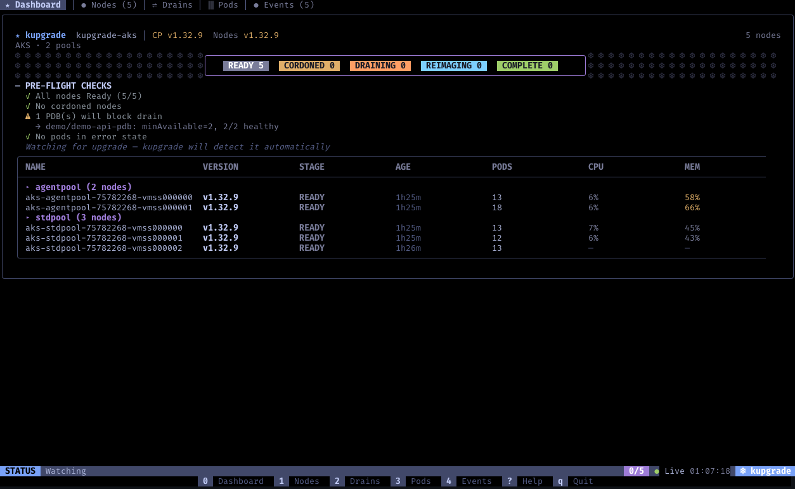
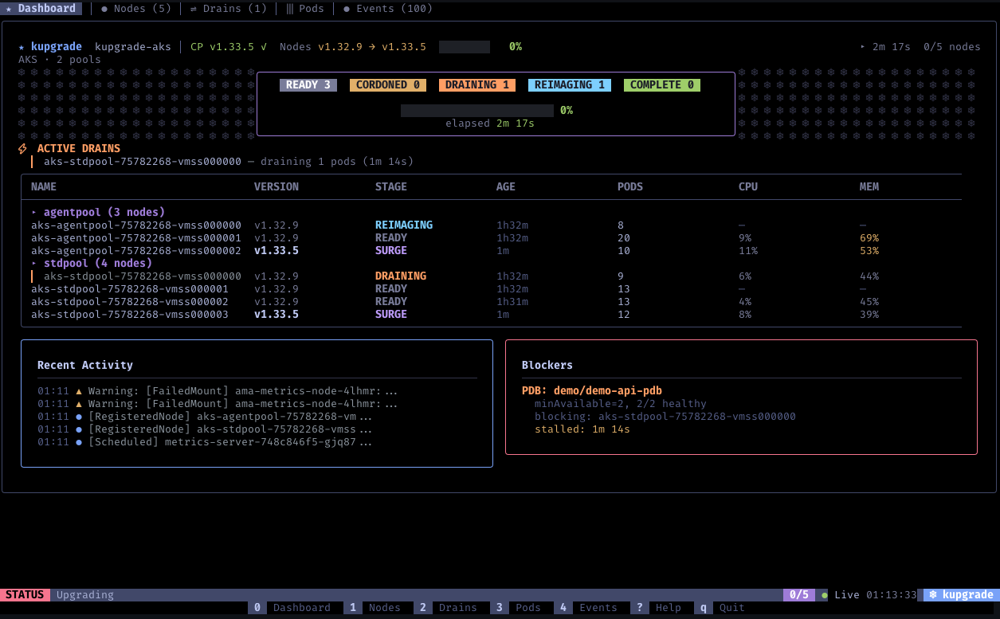
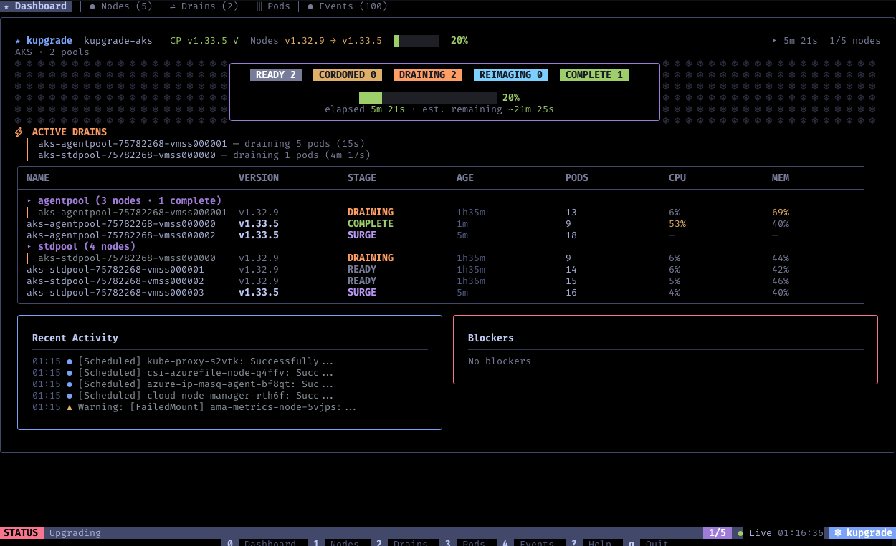
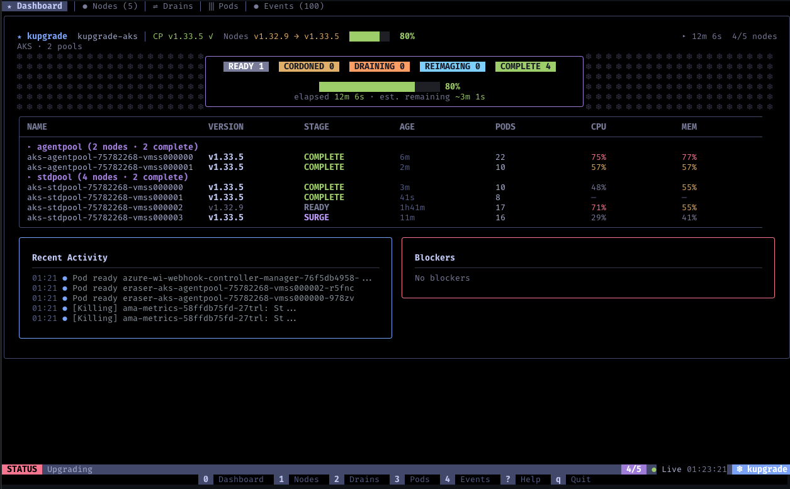
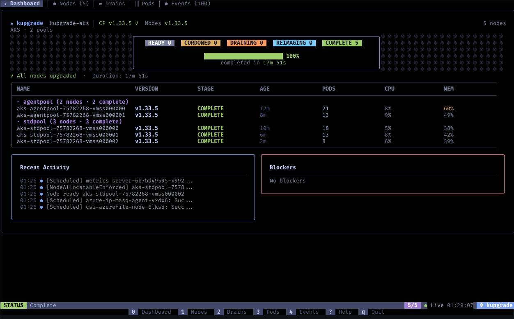
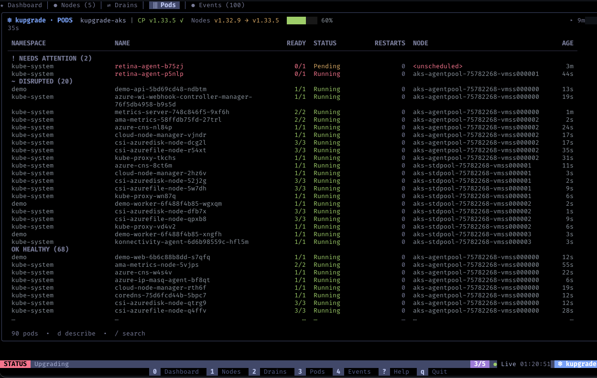
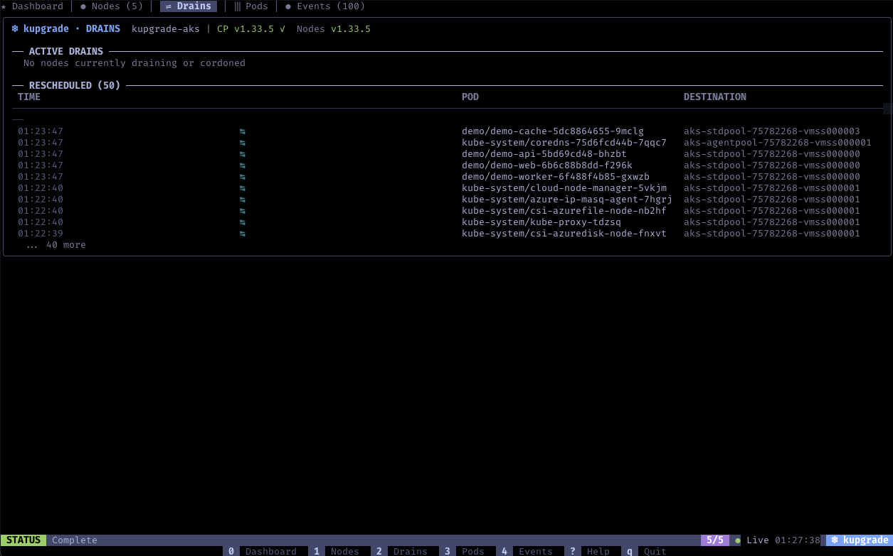
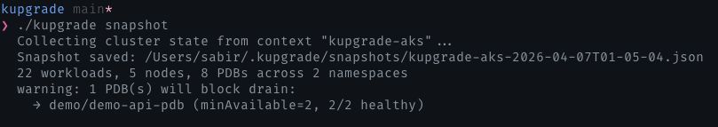
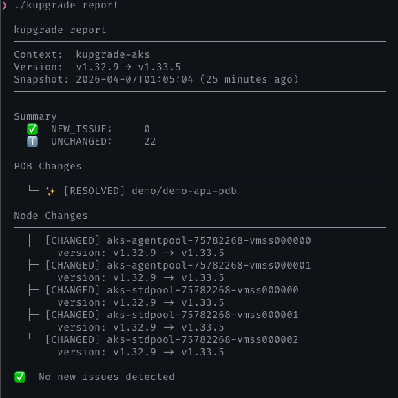

<div align="center">

# kupgrade

**Real-time terminal dashboard for Kubernetes node upgrades**

[](https://goreportcard.com/report/github.com/sabirmohamed/kupgrade)
[](https://github.com/sabirmohamed/kupgrade/actions/workflows/go.yml)
[](https://go.dev/)
[](https://github.com/sabirmohamed/kupgrade/releases)

Everything you need during a Kubernetes upgrade — one terminal.<br>
Nodes, pods, PDB blockers, drain progress, events, and before/after comparison.

[Why](#why) · [Install](#install) · [What you see](#what-you-see) · [Platform support](#platform-support)


</div>

---

## Why

Performing a multi-tenant cluster upgrade in production comes with a lot of mental overhead. I wanted one terminal view where I could see every node, what stage it's in, whether drains are moving, and which PDBs are blocking — and switch to pods, events, or kubectl describe without leaving the screen. Having everything in one place gives you peace of mind during an upgrade.

Before launching the TUI with `kupgrade watch`, you can run `kupgrade snapshot` to capture your cluster state. After the upgrade, run `kupgrade report` to see the diff — workloads, pods, PDBs, node versions. Did something new break, or was it already broken before you started?

---

## Install

```bash
# macOS / Linux
curl -fsSL https://raw.githubusercontent.com/sabirmohamed/kupgrade/main/install.sh | bash
```

```bash
# Go
go install github.com/sabirmohamed/kupgrade@latest
```

<details>
<summary>Build from source</summary>

```bash
git clone https://github.com/sabirmohamed/kupgrade
cd kupgrade
go build -o kupgrade ./cmd/kupgrade
```
</details>

Single binary on your laptop. No agents, no CRDs, no Helm charts, nothing deployed to the cluster. If you can run `kubectl get nodes`, you can run kupgrade — it uses read-only access to nodes, pods, events, and PDBs. Updates are real-time via Kubernetes informers, not polling.

---

## Usage

```
snapshot  →  upgrade           → watch  →   report
capture      kick off upgrade    observe    compare
baseline     (your CLI/Portal)   live       before/after
```

```bash
kupgrade snapshot               # 1. capture baseline before upgrade
kupgrade watch                  # 2. watch the upgrade in real time
kupgrade report                 # 3. compare after upgrade
kupgrade report --format json   # structured output for CI
```

---

## What you see

### Watching a live upgrade

**1. Pre-flight — PDB warning detected before upgrade starts**

kupgrade watches your cluster and warns about PDBs that will block drains before you even begin.



**2. Mid-upgrade — PDB blocker stalls the drain**

When a PDB blocks a drain, kupgrade shows exactly which PDB, which node, and how long it's been stalled.



**3. Progress — nodes completing after unblock**

After fixing the blocker, drains resume and nodes start completing. Progress bar, elapsed time, and estimated remaining.



**4. Almost there — 80% complete**



**5. Done — all nodes upgraded**



---

### Other screens

Press `1`-`4` to switch to detail views.

**Pods** — problems first, then disrupted, then healthy. Surfaces restarts, probe failures, and pods that moved during the upgrade.



**Drains** — rescheduled pods with source and destination nodes.



---

### Pre/post comparison

Take a snapshot before the upgrade, compare after.

**Before:**



**After:**



The report compares workloads, PDBs, and node versions before and after. Exit code is 1 if new issues are found, 0 if clean — paste the output into Slack or pipe `--format json` into your CI pipeline.

---

## What it tracks

| Resource | What kupgrade shows |
|----------|---------------------|
| **Nodes** | Stage transitions (Ready → Cordoned → Draining → Reimaging → Complete), surge nodes, version, CPU/MEM |
| **Pods** | Priority grouping (problems → disrupted → healthy), migrations, restarts, probe failures |
| **PDBs** | Flags PDBs that are actually blocking a drain, based on per-node eviction timing |
| **Events** | Severity-sorted, grouped by reason, with inline kubectl describe |

---

## Navigation

| Key | Action |
|-----|--------|
| `0-4` | Switch screens (Dashboard, Nodes, Drains, Pods, Events) |
| `j/k` or `↑/↓` | Navigate |
| `d` or `Enter` | kubectl describe |
| `e` | Expand/collapse event group |
| `/` | Search pods |
| `g` / `G` | Top / bottom |
| `?` | Help |
| `q` | Back / Quit |

---

## Platform support

Each cloud provider handles node upgrades differently. AKS reimages nodes in-place with the same name. EKS terminates and replaces them with new EC2 instances. GKE does rolling replacements one at a time. kupgrade detects your provider from node metadata and adapts — no flags, no config.

| Platform | Upgrade model | What kupgrade tracks |
|----------|---------------|----------------------|
| **AKS** | Reimage in-place | Surge nodes, reimage visibility, drain progress |
| **EKS** | Node replacement | Node replacement tracking, surge promotion |
| **GKE** | Rolling replacement | Rolling upgrade progress, one-at-a-time tracking |
| **Other** | Rolling upgrade | Standard cordon → drain → complete lifecycle |

Tested on real upgrades across all three providers, primarily focusing on AKS.

---

## What this isn't

- **Not a cluster browser** — [k9s](https://github.com/derailed/k9s) does that
- **Not an upgrade orchestrator** — your provider handles that (AKS, EKS, GKE, kOps)
- **Not a deprecation scanner** — [pluto](https://github.com/FairwindsOps/pluto) and [kubent](https://github.com/doitintl/kube-no-trouble) cover that

---

## Under the hood

- [bubbletea](https://github.com/charmbracelet/bubbletea), [lipgloss](https://github.com/charmbracelet/lipgloss), and [bubbles](https://github.com/charmbracelet/bubbles) for the terminal UI
- [cobra](https://github.com/spf13/cobra) and [cli-runtime](https://github.com/kubernetes/cli-runtime) for kubectl-compatible CLI flags
- [client-go](https://github.com/kubernetes/client-go) informers for real-time watching (no polling)
- [kubectl](https://github.com/kubernetes/kubectl) describe SDK for the detail overlay
- [fuzzy](https://github.com/sahilm/fuzzy) for pod search

---

<div align="center">

Apache 2.0 — See [LICENSE](LICENSE)

</div>
