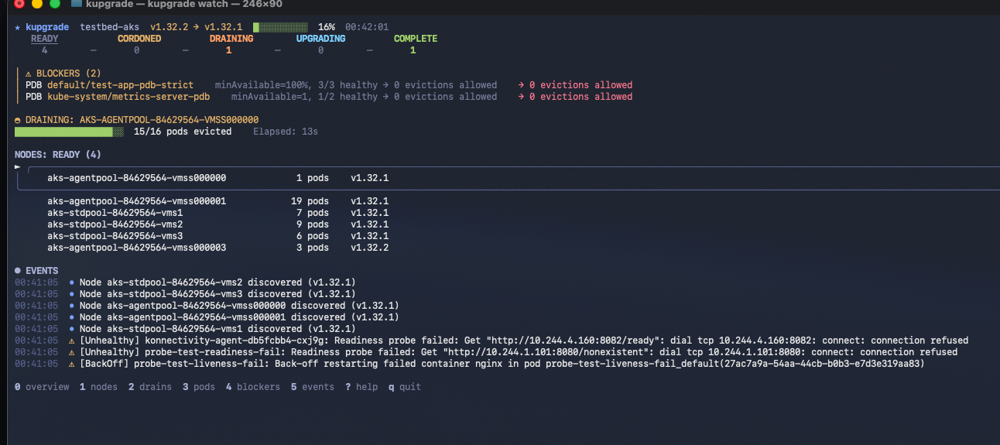

# kupgrade

The complete Kubernetes upgrade lifecycle tool.

**Pre-flight checks. Real-time observation. Post-upgrade reports.**



---

## The Problem

During Kubernetes upgrades, you need answers fast:

| Question | kubectl | k9s | kupgrade |
|----------|---------|-----|----------|
| Is the upgrade stuck? | `kubectl get nodes` + mental math | Check multiple views | Glance at progress bar |
| Which PDB is blocking? | `kubectl get pdb -A` + correlate | Search PDBs | Highlighted at top |
| How long until this node drains? | No visibility | No visibility | ETA with drain velocity |
| Where did that pod go? | Guess | Search | Migration tracking |

kupgrade shows you **exactly what matters during an upgrade** — nothing more, nothing less.

---

## The Three Questions

kupgrade answers the three questions platform engineers ask during every upgrade:

| Phase | Command | Question |
|-------|---------|----------|
| **Before** | `kupgrade check` | "Should I start this upgrade?" |
| **During** | `kupgrade watch` | "What's happening right now?" |
| **After** | `kupgrade report` | "What happened?" |

```bash
# Pre-flight: Check for deprecated APIs, problematic PDBs, unhealthy webhooks
kupgrade check --target-version v1.32

# Real-time: Watch the upgrade as it happens
kupgrade watch --context production

# Post-mortem: Generate upgrade summary
kupgrade report
```

---

## Quick Start

```bash
# Install
go install github.com/sabirmohamed/kupgrade@latest

# Watch your cluster upgrade in real-time
kupgrade watch --context my-cluster
```

That's it. You'll see:
- Node progression through upgrade stages (Ready → Cordoned → Draining → Upgrading → Complete)
- PDB blockers preventing evictions (with actionable details)
- Drain progress with elapsed time
- Pod migrations across nodes
- Events filtered to upgrade-relevant activity

---

## What You'll See

```
┌─────────────────────────────────────────────────────────────────────────┐
│ ★ kupgrade  prod-cluster  v1.28 → v1.29  ████████░░  62%  14:32:07     │
├─────────────────────────────────────────────────────────────────────────┤
│                                                                         │
│   READY  →  CORDONED  →  DRAINING  →  UPGRADING  →  COMPLETE           │
│     1          0            1            0             3                │
│                                                                         │
│ ⚠ BLOCKERS (1)                                                         │
│   PDB default/redis-pdb    minAvailable=2 → 0 evictions allowed        │
│                                                                         │
│ ◐ DRAINING: node-abc123                                                │
│   ████████████░░░░  18/24 pods evicted    Elapsed: 4m 12s              │
│                                                                         │
│ NODES (5)                                                              │
│ ► node-abc123    18 pods   v1.28   DRAINING                            │
│   node-def456    12 pods   v1.29   COMPLETE                            │
│   node-ghi789     8 pods   v1.28   READY                               │
│                                                                         │
├─────────────────────────────────────────────────────────────────────────┤
│ [d]etails  [b]lockers  [e]vents  [?]help  [q]uit                       │
└─────────────────────────────────────────────────────────────────────────┘
```

**Information hierarchy:**
1. Progress — Is the upgrade on track?
2. Blockers — What needs attention?
3. Active drains — What's happening now?
4. Node list — Details on demand

---

## Keyboard Navigation

| Key | Action |
|-----|--------|
| `d` | Drill into node/drain details |
| `b` | Blockers panel |
| `e` | Full event log |
| `↑/↓` or `j/k` | Navigate list |
| `←/→` or `h/l` | Switch stage (pipeline view) |
| `Enter` | Show details for selected item |
| `?` | Help |
| `q` | Back / Quit |

---

## CLI Options

```bash
# Watch specific cluster
kupgrade watch --context production-cluster

# Watch specific namespace only
kupgrade watch -n my-namespace

# Override target version detection
kupgrade watch --target-version v1.29.0

# Pre-flight check before upgrading
kupgrade check --target-version v1.32

# Run pre-flight, then watch
kupgrade watch --check-first
```

All standard kubectl flags are supported (`--context`, `--namespace`, `--kubeconfig`, etc).

---

## What kupgrade Tracks

| Resource | What's Watched |
|----------|----------------|
| **Nodes** | Stage transitions, version changes, conditions, taints |
| **Pods** | Evictions, migrations, health probes, restarts |
| **PDBs** | Disruption budgets blocking evictions |
| **Events** | Upgrade-relevant events (filtered from noise) |

---

## What This Isn't

- **Not a pre-upgrade compatibility scanner** — For API deprecation scanning without upgrade context, use [Pluto](https://github.com/FairwindsOps/pluto) or [kubent](https://github.com/doitintl/kube-no-trouble). kupgrade's `check` command focuses on upgrade-specific readiness.
- **Not an upgrade orchestrator** — Use your platform's tooling (kOps, EKS, GKE, AKS). kupgrade observes, it doesn't execute.
- **Not a replacement for k9s** — k9s is excellent for general cluster management. kupgrade complements it during the specific window of an upgrade.

---

## Roadmap

- [x] Real-time upgrade observer (`kupgrade watch`)
- [x] PDB blocker detection with details
- [x] Pod migration tracking
- [x] Drain progress with elapsed time
- [ ] Pre-flight checks (`kupgrade check`) — API deprecations, PDB readiness, webhook health
- [ ] **Pre-upgrade pod state snapshot** (`kupgrade check --snapshot`)
- [ ] **Post-upgrade diff report** (`kupgrade report --compare`) — See what broke vs. what was already broken
- [ ] Drain velocity and ETA calculation
- [ ] Blocker remediation suggestions
- [ ] SARIF output for CI/CD integration

---

## Requirements

- Go 1.22+ (for installation)
- kubectl access to your cluster
- Read permissions for nodes, pods, events, poddisruptionbudgets

---

## Architecture

For developers and contributors:

- **[Architecture Reference](docs/ARCHITECTURE.md)** — Complete codebase documentation, data flow, interfaces, and design decisions

This project follows the [Google Go Style Guide](https://google.github.io/styleguide/go/).

---

## Contributing

Contributions welcome! Please open an issue first to discuss what you'd like to change.

```bash
git clone https://github.com/sabirmohamed/kupgrade
cd kupgrade
go build -o kupgrade ./cmd/kupgrade
./kupgrade watch --context my-cluster
```

---

## License

Apache 2.0 — See [LICENSE](LICENSE)
