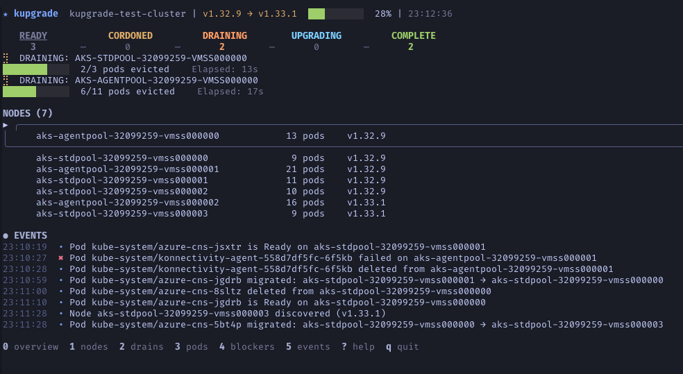

# kupgrade

Watch your Kubernetes cluster while it upgrades. One binary, one command, everything you need to see.


[](https://goreportcard.com/report/github.com/sabirmohamed/kupgrade)
[](https://github.com/sabirmohamed/kupgrade/actions/workflows/go.yml)
[](https://go.dev/)
[](https://github.com/sabirmohamed/kupgrade/releases)



---

## Why

When nodes start draining, you're switching between `kubectl get nodes -o wide`, `kubectl get pods -A`, and `kubectl get events` across terminals — or flipping through k9s views trying to keep up. When a PDB flashes red, is that actually blocking the upgrade or just normal pacing? Is that node stuck or just waiting its turn?

kupgrade gives you one screen with the full picture:

- **Unified view** — nodes, pods, PDBs, and events in one place
- **Knows when PDBs actually block** — distinguishes real blockers from normal drain pacing
- **Real-time** — informer-based updates, no polling
- **Single binary** — no agents or install on your cluster
- **Works everywhere** — AKS, EKS, GKE, or any Kubernetes cluster

---

## Install

**Quick install (macOS/Linux):**
```bash
curl -fsSL https://raw.githubusercontent.com/sabirmohamed/kupgrade/main/install.sh | bash
```

**Go install:**
```bash
go install github.com/sabirmohamed/kupgrade@latest
```

**Build from source:**
```bash
git clone https://github.com/sabirmohamed/kupgrade
cd kupgrade
go build -o kupgrade ./cmd/kupgrade
```

---

## Usage

```bash
kupgrade watch                  # Live upgrade monitoring
kupgrade watch --context prod   # Specific cluster
kupgrade snapshot               # Save pre-upgrade baseline
kupgrade report                 # Post-upgrade diff
kupgrade report --format json   # For scripting/CI
```

All standard kubectl flags work (`--context`, `--namespace`, `--kubeconfig`).

---

## What you see

### Live upgrade monitoring

Point it at your cluster during an upgrade:
- **Progress bar** with percentage and stage counts
- **Active drains** with pod eviction progress and elapsed time
- **PDB status** — risks vs active blockers (more on this below)
- **Surge nodes** labeled and tracked separately

### Pre/post comparison

Take a snapshot before you upgrade, compare after:

```bash
$ kupgrade snapshot
  Snapshot saved: ~/.kupgrade/snapshots/prod-cluster-2026-02-02T14-54-32.json
  64 workloads, 9 nodes, 23 PDBs across 21 namespaces

$ kupgrade report
  [NEW_ISSUE]    deployment/api-server: 2 pods not ready
  [PRE_EXISTING] deployment/legacy-worker: 1 pod CrashLoopBackOff
  [RESOLVED]     pdb/redis-pdb: was blocking, now has budget
```

The output works without colors — paste it into Slack or your incident channel.

---

## TUI screens

Press number keys to switch between screens:

| Key | Screen | Shows |
|-----|--------|-------|
| `0` | Overview | Progress bar, stage counts, PDB risks/blockers, active drains |
| `1` | Nodes | All nodes with stage, version, pod count, surge labels |
| `2` | Pods | Pod states, migrations, restarts |
| `3` | Drains | Active drain progress with elapsed time and stall detection |
| `4` | Blockers | PDB risks (yellow) vs active blockers (red) |
| `5` | Events | Upgrade-relevant events with filters |


### Navigation

| Key | Action |
|-----|--------|
| `↑/↓` or `j/k` | Navigate lists |
| `Enter` | Show details |
| `?` | Help overlay |
| `q` | Back / Quit |
| `/` | Fuzzy search pods |
| `u/w/a` | Event filter (upgrade/warnings/all) |

---

## What it tracks

| Resource | What |
|----------|------|
| Nodes | Stage transitions (Ready → Cordoned → Draining → Reimaging → Complete), surge nodes |
| Pods | Evictions, migrations across nodes, restarts, probe failures |
| PDBs | Two-tier status: risks vs active blockers |
| Events | Filtered to upgrade-relevant activity |

### PDB intelligence

A PDB with zero disruptions allowed isn't necessarily blocking your upgrade — it might just be pacing the drain normally. kupgrade distinguishes between:

- **PDB risks** (yellow) — budget exhausted, but drain is still progressing
- **Active blockers** (red) — drain stalled for 30+ seconds with no pod evictions

No more false alarms from transient PDB states.

---

## Platform support

Works with any Kubernetes cluster that does rolling node upgrades. Built and battle-tested on AKS for now - working in progress for other platforms.

| Platform | Stage Pipeline | Notes |
|----------|---------------|-------|
| **AKS** | Ready → Cordoned → Draining → Reimaging → Complete | Full lifecycle including surge nodes |
| **GKE/EKS** | Ready → Cordoned → Draining → Complete | No Reimaging stage (nodes replaced, not reimaged) |
| **Other** | Ready → Cordoned → Draining → Complete | Standard rolling upgrades |

---

## What this isn't

- **Not a cluster browser** — use k9s for that
- **Not an upgrade orchestrator** — your platform handles that (AKS, EKS, GKE, kOps)
- **Not a deprecation scanner** — use [pluto](https://github.com/FairwindsOps/pluto) or [kubent](https://github.com/doitintl/kube-no-trouble)

---

## Requirements

- kubectl access to your cluster
- Read permissions: nodes, pods, events, poddisruptionbudgets

---

## Under the hood

`kupgrade` uses:

- [bubbletea](https://github.com/charmbracelet/bubbletea), [lipgloss](https://github.com/charmbracelet/lipgloss), and [bubbles](https://github.com/charmbracelet/bubbles) for the terminal UI
- [cobra](https://github.com/spf13/cobra) and [cli-runtime](https://github.com/kubernetes/cli-runtime) for kubectl-compatible CLI flags
- [client-go](https://github.com/kubernetes/client-go) informers for efficient real-time watching (no polling)
- [kubectl](https://github.com/kubernetes/kubectl) describe SDK for the detail overlay
- [fuzzy](https://github.com/sahilm/fuzzy) for pod search

---

## Development

Built with assistance of [Claude Opus 4.5](https://claude.ai) using the [BMAD Method](https://github.com/bmadcode/BMAD-METHOD), following [Google's Go Style Guide](https://google.github.io/styleguide/go) and [Effective Go](https://go.dev/doc/effective_go).

---

## License

Apache 2.0 — See [LICENSE](LICENSE)
